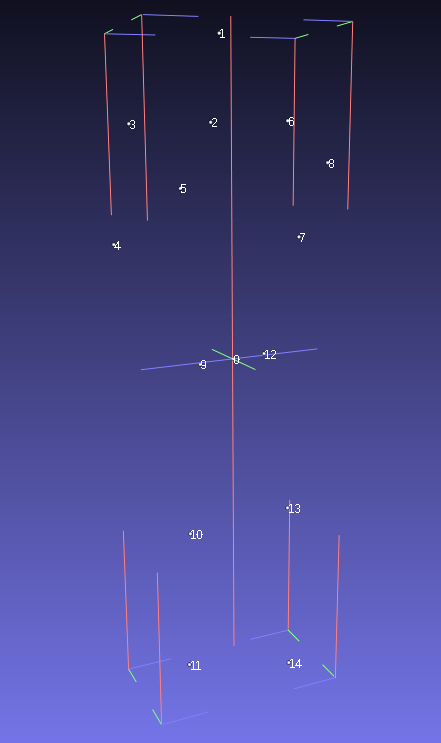

<h1>Echtzeit Bewegungsklassifizierung mithilfe von Zeitfaltungsnetzen auf Basis von Gelenkerkennung mit Tf-Pose</h1>
<h2>Das Projekt aufsetzen</h2>
Abhängigkeiten:<br>
Die Projektarbeit wurde auf einem JetsonTX2 mit Jetpack 4.2 durchgeführt.
Ältere/Neuere Versionen werden unter Umständen nicht unterstützt, insbesondere mit Blick auf die Tensorflow-Version, die für Tf-Pose benötigt wird!<br>
<ol>
<li>Für nicht-ARM Architekturen:<br>
Alle für das Projekt benötigten Abhängigkeiten finden sich in der `Requirements.txt` <br>
Zusätzlich müssen OpenCv und Pyrealsense installiert werden. Für die Nutzung von TensorRT mit tf-Pose wird des weiteren eine CUDA-fähige NVIDIA Karte so wie eine CUDA und cudnn Installation benötigt.
Bei der Realsense Installation kann es ebenfalls zu Abhängigkeits-Problemen mit der Python Version kommen. Gegebenenfalls muss Python 3.5.2 verwendet werden.<br>
</li>
<li>
Für Jetson TX und ähnliche:<br>
<ul>
<li>Realsense Kamera:<br>
Für die Nutzung der Realsense Kamera in Python werden Python Wrapper benötigt. Die geliferten Wrapper über Pip unterstützen jedoch keine ARM Architektur. so müssen wir die Wrapper selber bauen. <br>
Interessant sind hierfür folgende Ressourcen:<br>
Diese enthalten sowohl die detaillierte Anweisung zum Bau der Wrapper als auch häufig auftretende Fehler.
https://github.com/IntelRealSense/librealsense/blob/development/doc/installation_jetson.md
https://github.com/IntelRealSense/librealsense/tree/master/wrappers/python#building-from-source
https://github.com/IntelRealSense/librealsense/blob/development/doc/installation.md
https://www.bountysource.com/issues/56318982-installing-d435-on-jetson-tx2
https://github.com/IntelRealSense/librealsense/issues/1424
https://github.com/IntelRealSense/librealsense/issues/2586
https://www.jetsonhacks.com/2016/06/20/intel-realsense-camera-installation-nvidia-jetson-tk1/
https://github.com/IntelRealSense/librealsense/issues/1320</li>
<li>
Tensorflow:<br>
Auch Tensorflow unterstützt von Haus aus keine ARM-Prozessoren.
Die Installations-Wheels für Pip müssen also auch individuell gebaut werden. Glücklicherweise stellt NVIDIA eigene Wheels zur Verfügung. <br>
Warnung: Je nach Jetpack Version werden nicht alle Installions-Wheels unterstützt. so sind verschiedene ältere Tensorflow Versionen auf neueren Jetpack Versionen nicht direkt erhältlich. Tf-Pose unterstütz jedoch maximal Tensorflow 1.14. Solange NVIDIA in Zukunft den Support für 1.14 nicht fallen lässt, sollte die kein Problem sein.<br>
Hier der <a href = 'https://docs.nvidia.com/deeplearning/frameworks/install-tf-jetson-platform/index.html'>Link</a> zur offiziellen Anleitung.
</li>
<li>Matplotlib:<br>
Bei Matplotlib kann es ebenfalls zu Probleme mit der Architektur kommen. In dem Fall sind folgende Ressourcen hilfreich:
https://pypi.org/project/Cython/
https://devtalk.nvidia.com/default/topic/1044627/jetson-agx-xavier/-quot-pip-install-scikit-learn-quot-failing-on-xavier-board/
https://devtalk.nvidia.com/default/topic/1044185/tx2-install-matplotlib-error/
</li>
<li>
Tf-Pose:<br>
Link zum Repository: https://github.com/ildoonet/tf-pose-estimation <br>
Tf-Pose verfügtüber eine gut dokumentiere Installation und verlinkt die entsprechende wissenschaftliche Veröffentlichung, welche den Aufbau und die Funktion des Modells beschreibt.  
</li>
<li>
OpenCV:<br>
Open CV ist nach einem Flash mit Jetpack im Normalfall immer Vorhanden. Allerdings wird die Python Library für OpenCv global hinterlegt. Bei verwendung einer virtuellen Umgebung für Python muss also folgender Trick angewendet werden: <br>
Unter /usr/lib/python3.6/dist-packages findet sich die cv2.so Der genaue Name und Pfad kann sich je nach Jetpack Version unterscheiden. Ähnlich der Vorgehensweise bei der installation von Pyrealsense kann nun entweder der PYTHONPATH um den entsprechenden Pfad erweiter werden (Wird nicht empfohlen, da ansonsten unter Umständen die komplette globale PYthon-umgebung in der virtuellen umgebung mitgenutzt wird, nicht nur OpenCV. Bei Verwendung einer virtuellenUmgebung ist das nicht, was wir wollen.), oder aber wir kopieren die .so in den My_virtuel_env/lib/python3.x/site-packages Ordner unserer virtuellen Umgebung.
</li>
</ul>
</li>
</ol>
Bevor das Projekt richtig lauffähig ist, muss dies `estimator.py` file im tf-pose Projekt durch die in `thirdparty/tf-pose` hinterlegte `estimator.py` ersetzt werden, da einige Anpassungen zur Steigerung der Performance und vorgenommen wurden.


<h2>Das Projekt ausführen</h2>
Das Projekt kommt mit einem fertig trainierten Modell zu Bewegungserkennung.
Unter src/movement_detection findet sich die movement_detection.py . Diese startet die Kameraaufnahme und Echtzeiterkennung. Das Tf-Pose Modell benötigt einige Zeit um erstellt zu werden. Die ist eine wiederkehrende Wartezeit.
In der aktuellen Umsetzung wird nur der Oberkörper betrachtet.
Bei erweiterter Nutzung müssen gegebenenfalls die AMASS Daten nachgeladen werden. Die entsprechenden Ressourcen finden sich hier:
Datensatz: (erfordert Registrierung): https://amass.is.tue.mpg.de/
Interessante aber nicht relevante Tutorials: https://github.com/nghorbani/amass

Weitere Funktionen:<br>
<ul>
<li>Bewegung aufnehmen und visualisieren:<br>
Unter `keypoint_extraction` im `src` Ordner finden sich 3 Skripte zum extrahiee von Gelenkpunkten.
2 Davon sind für Kameraaufnahmen und die dritte für Daten aus dem AMASS Datensatz.
Das `.xyz` Extrahierungsskript schreibt für jedes gefilmte Frame in `.xyz` Dokument mit Gelenkkoordinaten und stoppt nach 160 gefilmten Frames. Das andere schreibt alles in `.csv` Format nieder und läuft unbegrenzt mit dem `animate.py`
Skript aus `thirdparty/mdd` kann nun aus einer Folge von erstellten `.xyz` Dokumenten ein `.obj` Objekt sowie ein `.mdd` dokument erstellt werden, um die Bewegung in Blender anzuzeigen.
Einzelne Positionen können in einem Meshviewer wie MeshLab angezeigt werden, indem das entsprechende `.xyz` dokument einfach in den Viewer geladen wird. </Li>
<li>Erstellen von Trainingsdaten:<br>
Mit dem `training_data_preparation.py` Skript könnenausgewählte Sequenzen in das vorgesehene Datenformat umgewandelt und somit Trainingsdaten generiert werden. Das genaue Dateformat wird im Punkt "Generieren von Trainingsdaten genauer beschrieben"
</li>
<li>Modell Trainieren:<br>
Mit `tensorflow_model.py` kann ein neues Zeitfaltungsnetz trainiert werden. die entsprechenden Trainingsdaten werden alle aus dem Traingsdaten Ordner gezogen und das Modell sowie die entsprechenden Metriken automatisch mit dem aktuellen Datum versehen und unter Models abgespeichert. Der Pfad zum neuen Model muss dann nur noch in der `movement_detection.py` angepasst werden.
</li>
</ul>
Das Ausführen der Extrahierungsskripte erfolgt, wenn vorhanden, über die `.sh` Skripte und nicht über Python, da bestimmte Pfade für die Modellgenerierung vorher noch gesetzt werden müssen.

<h2>Abstract</h2>
Diese Projektarbeit beschäftigt sich mit der Erkennung vn bestimmten Bewegungen anhand des Gelenkverlaufes bei Personen. Die hierfür benötigten Gelengpositionen sollen mithilfe einer Gelenkerkennung in Echtzeit aus einer 3d-Kameraufnahme entnommen werden. Das ganze soll auf einer embedded Plattform umgesetzt werden, in diesem Falle eines Jetson TX2 von NVIDIA. Die Verarbeitungsgeschwindigkeit einzelner Bilder beträgt dabei 7-8 FPS und es wird eine Boxbewegung erkannt, die aus dem Bereithalten einer Deckung sowie Zuschlagen besteht.
<h2>Inhalt</h2>
<ol>
<li>Einführung</li>
<li>Ablauf</li>
<li>Installation</li>
<li>Extrahieren von Gelenkpunkten</li>
<li>Generieren von Trainingsdaten</li>
<li>Modell trainieren</li>
</ol>
<h2>Einführung</h2>
Dieses Projekt ist eine Weiterführung des im WiSe1819 durchgeführten Automatisierungslabor bei dem mithile von OpenPose und Dynamic Time Warping eine Kniebeugenbewegung erkannt wurde. Diese Fortführung setzt dabei auf einen performanteren Embedded Chip mit GPU Funktionalität sowie ein leichtgewichtigeres Modell zur Gelenkerkennung, um höhere Frameraten zu gewährleisten. Die extrahierten Gelenkpunkte sollen dann durch ein Zeitfaltungsnetz einer bestimmten Geste zugeordnet werden, alles in Echtzeit. Die zum Trainieren des Modell benötigten Daten werden aus dem AMASS Datenset generiert. 
<h2>Ablauf</h2>
DEr Ablauf der Arbeit unterteilt sich in mehrere Phasen, bei denen jeweils andere Komponenten des Projektes in den Schwerpunkt rücken.
<h3>Installation</h3>
Unter Installation versteht sich in diesem Zusammenhang die Auflösung der Abhängigkeiten zwischen den Verschiedenen benötigten Libraries und deren Installation. Dies ist insebsondere dadurch erschwert, dass es sich beim Jetson TX2 Board um einen ARM Prozessor handelt. Diese Prozessor-Architektur wird von vielen Libraries nicht von Haus aus unterschtützt, was das Ausfsetzen einer funktionierenden Arbeitsumgebung deutlich verkompliziert. Für folgende benötigte Libraries waren somit individuelle Lösungen notwendig:
<ul>
<li>Python Wrapper für die Realsense Kamera</li>
<li>Tensorflow</li>
<li>Tf-Pose</li>
<li>OpenCV</li>
</ul>
Die genauen Schritte, die zum Bauen dieser Libraries notwendig waren, finden sich in den Ressourcen, die unter dem Punkt "Das Projekt aufsetzen" aufgelistet wurden. Um die Notwendigen Abhängigkeiten an beispielsweise CUDA und cudnn, die zur Nutzung der GPU Beschleunigung der ML Modelle benötigt werden, zu gewährleisten, war auch eine komplette Aktualisierung des Jetson TX2 notwendig. So musste das Board zuerst geflashed und mit der aktuellsten JetPack Version, Version 4.2, aufgesetzt werden. Diese Installation lieferte auch gleich OpenCV mit.
<h3>Extrahieren von Gelenkpunkten</h3>
Nachdem Kamera, OpenCV und TF-Pose am Laufen sind, können nun die Koordinaten der erkannten Gelenkpunkte extrahiert werden. Dieser Vorgang umfasst jedoch mehrere wichtige Schritte:
<ol>
<li>Auswahl der benötigten Gelenkpunkte:<br>
Je nach Anwendungsfall werden nicht alle Gelenkpunkte benötigt. Um Rechenleisung einzusparen werden nicht benötigte Keypoint weggelassen.</li>
<li>Berechnen eines Körpermittelpunktes:<br>
Mithilfe ausgewählter Gelenkpunkte der linken und rechten Hüftseite wird ein Körperschwerpunkt berechnet.</li>
<li>Berechnung der z-Koordinate der 2D-Gelenkpunkte:<br>
Überlappung des 2d-Farbbildes mitsamt erkannten 2D-Gelenkkoordinaten mit dem Tiefenbild der Realsense Kamera um 3D Koordinaten für jeden Keypoint zu berechnen</li>
<li>Umrechnen der Pixelkoordinaten in das Koordinatensystem der Kamera</li>
<li>Transformation der Keypointkoordinaten ins Koordinatensystem des Körpers:<br>
Um die Daten jedes Bewegung koherent und unabhängig von der Position des Menschen im Raum darzustellen, transformieren wir die Keypoints in ein Körpereigenes Koordinatensystem. Dieses bauen wir auf, indem wir eine x-Achse über den Körperschwepunkt und die linke Hüftsteite aufziehen und eine y-Achse vom Körperschwerpunkt nach oben zum Halsansatz. Die z-Achse ergibt sich dann aus dem Kreuzprodukt der beiden andeen Achsen. Die so entstandenen Vektoren werden nromiert und stellendann die Normlvektoren unseres neuen Koordinatensystems dar. Nebeneinander aufgestellt ergeben sie die Rotationsmatrize, mithilfe derer wir alle Keypoints in das neue Koordinatensystem transformieren können.</li>
</ol>
Die Gleiche Vorgehensweise verfolgen wir bei der Extrahierung von Keypoints aus dem AMASS Datensatz, der uns als Trainingsdatensatz dienen wird.<br>
Wichtig hierbei ist, dass Keypoints gewählt werden, die ein Mapping zwischen den von AMASS verwendeten smplh Körpermodellen und dem tf-pose Modell erlauben. Beim abspeichern der Daten sit somit auch die Reihenfolge der Kypoints in der Datenstruktur ausschlaggebend. Ein solches Mapping sieht in unserem Projekt wie folgt aus:

| Tf-Pose  | SMPL-H |
| ---- | ---- |
| 1 | 15 |
| 2 | (17 + 16)/2 |
| 3 | 17 |
| 4 | 19 |
| 5 | 21 |
| 6 | 16 |
| 7 | 18 |
| 8 | 20 |
| 9 | 2 |
| 10 | 5 |
| 11 | 8 |
| 12 | 1 |
| 13 | 4 |
| 14 | 7 |

Die Körper Keypoints im Vergleich (vor Umwandlungen):<br>
Das smplh Modell mit Keypoints<br>


Das tf-pose Modell mit Keypoints<br>


Smplh Modell in Boxing Pose nach Transformation:<br>



<h3>Generieren von Trainingsdaten</h3>
Mit der Möglichkeit geschaffen, für jeden Frame die Keypointkoordinaten zu extrahieren, kann nun auf dieser Basis mit aufgeneommenen Bewegungssequenzen ein Trainingsdatenset generiert werden. Das AMASS Datenset bietet hier eine breite Auswahl an verscheidenen Bewegungsmustern, aufgenommen mit modernen Motioncapture Geräten und von Personen verschiendster Statur. SMPLH Modelle erlauben sogar, darüber hinaus mit den gleichen Aufnahmen weitere Sequenzen zu generieren, indem die Körperproportionen verändert werden. Dies wird jedoch in dieser Arbeit direkt nicht weiter betrachtet.  
Die Datengenerierung läuft nun so ab, dass für jede Sequenz, je nach aufgenommener Person, das enstrpechende smplh-Modell gewählt wird. Dieser Modell werden die in der Sequenz hinterlegt Körperproportionen übergeben. Für jedes Frame in der Sequenz wird nun dem Modell die passende Pose angeheftet, das Modell geladen und die Keypoints extrahiert. So ensteht eine Abfolge an Keypoints für jede Bewegung. In jede Trainingssequenz werden jeweils 15 Frames geladen. Um eine höhere Sequenzmenge zu bilden, werden jeweils 2 Trainingssequenzen gleichzeitig gefüllt, jeweils mit einem Abstand von 8 Frames zueinander. Da die Sequenzen mit 120 FPS aufgenommen werden, wir aber nur maximal 7-8 FPS mit unserer Gelenkerkennung, sampeln wir die Datensätze langsamer und nehmen nicht jedes Frame, sondern jedes 120/7 = 17te Frame.<br>
Jede Sequenz wird dann noch annotiert, ob es sich um die zu erkenndne Bewegung, handelt oder nicht.<br>
Die Datenstruktur sieht dann für eine Sequenz von 15 Frames folgendermassen aus:<br>
`[[[keypoint0],[keypoint1]...,[keypoint10]], Klasse]` mit `[[KeypointX] = [x1,y1,z1,x2,y2,z2,......,x15,y15,z15]` <br>
Ein Zweidimensionales Array mit Höhe 11, Breite 45 und Tiefe 1: (11,45,1).<br>
<h3>Modell trainieren</h3>
Das Trainieren des Modells erwies sich nach einer kurzen Vertraumachung mit Tensorflow und Keras als recht unkompliziert. Lediglich die genause Struktur des Netzes sowie die Dimensionen der Zeitfaltung erforderten genauere Überlegungen.
So soll nur über die Zeit hinweg gefaltet werden, um den Verlauf von Bewegungen zu analysieren. Nicht aber soll über die verschiedenen Keypoins hinweg gefaltet werden. Der erste Falsungskern sieht dementsprechend folgendermassen aus: <br>

Ein (11,9) Faltungskern, der über 3 frames hinweg faltet und sich ein jeweils ein Frame(Also um eine Koordinate mit 3 Werten) weiter bewegt.<br>
```
|x1,y1,z1,x2,y2,z2,,x3,y3,z3|,...,x15,y15,z15
|x1,y1,z1,x2,y2,z2,,x3,y3,z3|,...,x15,y15,z15
|x1,y1,z1,x2,y2,z2,,x3,y3,z3|,...,x15,y15,z15
|...........................|   --->   
|x1,y1,z1,x2,y2,z2,,x3,y3,z3|,...,x15,y15,z15
|x1,y1,z1,x2,y2,z2,,x3,y3,z3|,...,x15,y15,z15

```
Das Netz insgesamt hat folgenden Aufbau:
<ol>
<li>Faltung mit (11,9) Kernel und 32 Filtern Output</li>
<li>Maxpooling mit (1,3) Kernel</li>
<li>Faltung mit (1,3) Kernel und 64 Filtern Output</li>
<li>Flattening der Daten</li>
<li>4 versteckte Layer für voll verbundenes neuronales Netzwerk mit 100 Schichten runter auf 20</li>
<li>1 Ausgangslayer für voll verbundesnes NN mit einer Ausgangsschicht und sigmoid Aktivierung für binäre Klassifizierung der Bewegung.</li>
</ol>
<h3>Modell zusammenfassung:</h3>

|Layer (type) | Output Shape | Param # |
| --- | --- | --- |
|conv2d (Conv2D) | (None, 1, 13, 32) | 3200 |
| max_pooling2d (MaxPooling2D) | (None, 1, 4, 32) | 0 |
| conv2d_1 (Conv2D) | (None, 1, 2, 64) | 6208 |   
| flatten (Flatten) | (None, 128) | 0 |
| dense (Dense) | (None, 100) | 12900 |
| dense_1 (Dense) | (None, 50) | 5050 |
| dense_2 (Dense) | (None, 20) | 1020 |
| dense_3 (Dense) | (None, 20) | 420 |
| dense_4 (Dense) | (None, 1) | 21 |

Total params: 28,819<br>
Trainable params: 28,819<br>
Non-trainable params: 0<br>
_________________________________________________________________

<h3>Modell Metriken:<br></h3>
Genauigkeit auf Trainingsdaten: 0.9189<br>
Konfusions Matrix:<br>

| is\predicted | cl1 | cl2 |
| -- | -- | -- |
| cl1 | 283 | 6 |
| cl2 | 24 | 57 |

Genauigkeit auf Testdaten: 0.9692<br>
Konfusions Matrix:<br>

| is\predicted | cl1 | cl2 |
| -- | -- | -- |
| cl1 | 50 | 1 |
| cl2 | 1 | 13 |

<h2>Resultate und Fazit</h2>
Das Modell an sich wurde überraschend genau. In der Echtzeiterkennung liegt die Framerate bei 7 FPS und Boxen wird oft korrekt erkannt, obwohl das Datenset in der ersten Iteration vergleichsweise klein war, mit 435 Sequenzen insgesamt, davon 95 für die Boxbewegung. Das Modell reagiert besonders auf eine hoch gehaltene Deckung, weniger auf das 'Boxen' mit der Faust. Boxen mit der linken Hand wird in 50% der Fälle erkannt, mit der rechten Hand hingegen so gut wie nie.
Dies liegt wahrscheinlich an den Trainingsdaten, welche in jedem Fall eine hochgehaltene Deckung und oftmals keine Schläge beinhalten. Auch scheint es mehr Schläge mit der linken als mit der rechten Hand gegeben zu haben. 
Alles in Allem ist die Leistung es Modelles im Rahmen der Projektarbeit allemal zufriedenstellend.<h2>Mögliche Erweiterungen und Verbesserungen</h2>
Da das volle potential des AMASS Datensatzes nicht ausgenutzt wurde, sondern nur der HumanEva Datensatz zum Training verwendet wurd, kann davon ausgegangen werden, dass das Modell noch enorm verbessert werden kann. Auch eine Optimisierung bei der Koordinatentransformation und anderen Stellen in der Echtzeitauswertung würde durchaus die Framrate bei der der Echtzeiterkennung verbessern. Es bietet sich an, das Modell zur Bewegungserkennung auf mehrere Bewegungen auszuweiten.
Um die Wartezeit beim Starten der Echtzeitauswertung zu verringern könnte die TensorRT Engin, die jedes Mal aufs neue gebaut wird, abgespeichert und geladen werden. Auch das Modell zur Bewegungserkennung könnte potentiell mit TensoRT GPU-beschleunigt werden. 

